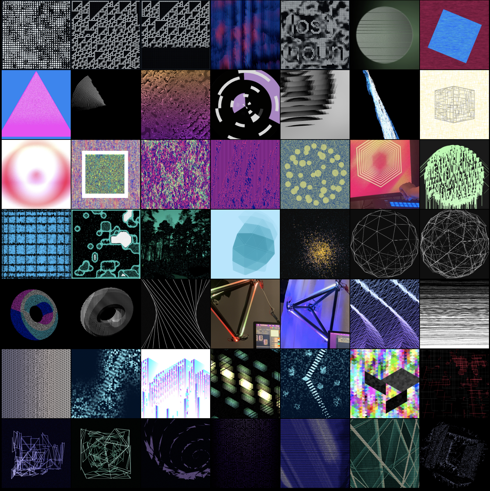
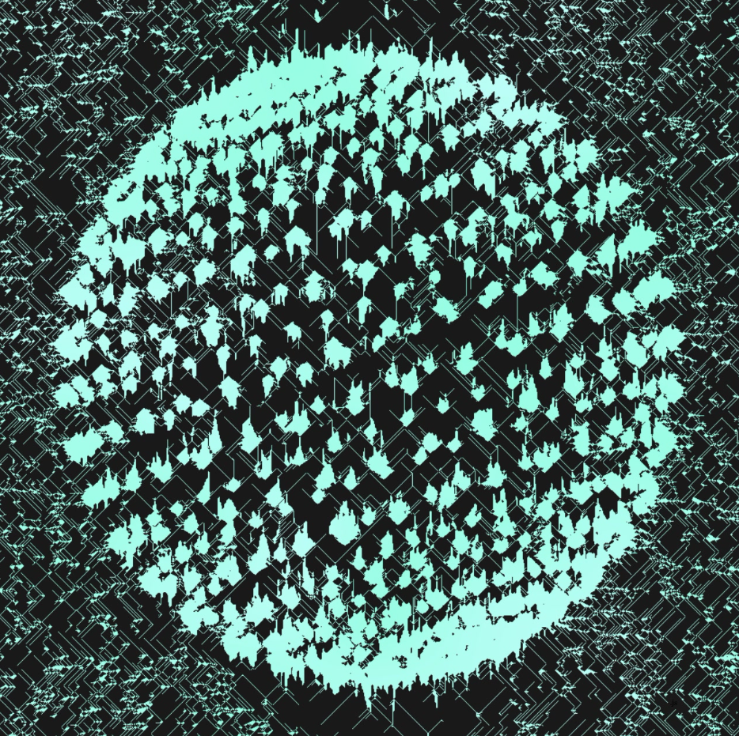

# 7 weeks of making

Eventually this will end up in a blog post! But just so I have something to link to:

I did daily art in TouchDesigner for 49 days as part of a #7weeksofmaking challenge! This was fun, using statistical learning on images of cream cheese and making a trianglar coordinate system.

## Full grid

Here's my full grid of the 49 days

## Videos

Many of these were actually videos, like this one:

<a href="https://www.youtube.com/watch?v=ayNBHlTMyHI">[link]</a>

## Other favorites

And here are larger versions of a few of my favorites:

  
